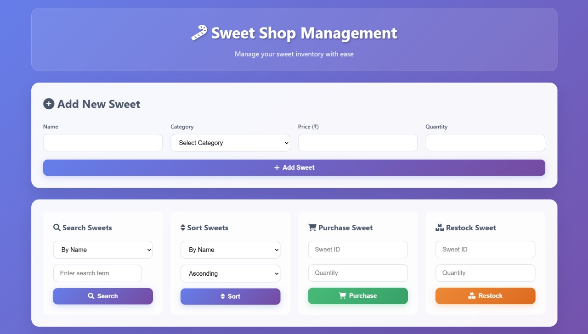
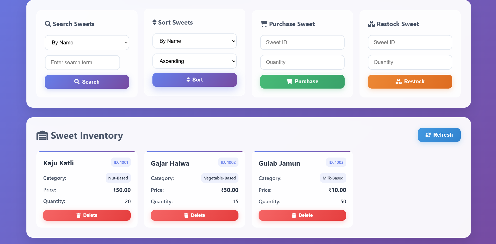

# 🍬 Sweet Shop Management System

This project is a basic inventory and transaction management system for a sweet shop. Built using **JavaScript** and developed using **Test-Driven Development (TDD)** practices, it supports adding, viewing, deleting, searching, purchasing, and restocking sweets.

> 🧪 Every feature is backed by unit tests using **Jest**. No database is used; in-memory classes manage the data for simplicity and clarity.

---

## 🚀 Features

- ✅ Add new sweets with ID, name, category, price, and quantity  
- ✅ Delete existing sweets  
- ✅ View all sweets in inventory  
- ✅ Search sweets by name, category, or price range  
- ✅ Sort sweets by name or price  
- ✅ Purchase sweets (decrease quantity, with stock validation)  
- ✅ Restock sweets (increase quantity)  

---

## 🧱 Technologies Used

- **JavaScript** (ES6+)  
- **Node.js**  
- **Jest** (unit testing)  
- **Git** (version control)  

---

## 🧪 Test-Driven Development

This project follows the principles of TDD:

1. Write the test first  
2. Implement the minimum code to pass the test  
3. Refactor for clean code  

> 📄 All tests are located inside the `tests/` directory.

To run the test suite:
```bash
npm install
npm test
```

To generate a coverage report:
```bash
npm test  --coverage
```

If you have configured `jest-html-reporter`, an HTML report will be generated at `test-report.html` after running tests.

---

## 📂 Project Structure

```
sweet-shop-management-system/
├── src/
│   ├── Sweet.js          # Model class for a sweet
│   ├── Inventory.js      # Core logic to manage sweets
├── tests/
│   └── inventory.test.js # All test cases
├── frontend/
│   └── index.html        # Front-end UI (optional)
├── screenshots/          # Front-end screenshots
├── test-report.html      # Generated after running tests
├── README.md
├── package.json
└── .gitignore
```

---

## 🛠️ Setup Instructions

1. **Clone the repository**  
   ```bash
   git clone https://github.com/ronVK18/Kata-Sweet-Shop-Management-System.git
   cd Kata-Sweet-Shop-Management-System
   ```

2. **Install dependencies**  
   ```bash
   npm install
   ```

3. **Run tests**  
   ```bash
   npm test
   ```

4. **(Optional) Generate coverage or HTML report**  
   ```bash
   npm test  --coverage
   ```

---

## 📊 Test Report

After running tests with `jest-html-reporter`, open the following file in your browser to view a detailed HTML test report:
```
test-report.html
```

---

## 📸 Front-End 

A basic front-end interface is available at:

```
frontend/index.html
```

### 👉 To view the front-end using Live Server:

1. Open the project folder in **VS Code**
2. Right-click on `frontend/index.html`
3. Click **"Open with Live Server"**
4. The page will open in your browser at:  
   `http://127.0.0.1:5500/frontend/index.html` (or similar)

> 💡 Make sure you have the **Live Server** extension installed in VS Code.

---

## 🖼️ Screenshots

Screenshots of the front-end UI are available in the `/screenshots` folder.

Example:  




